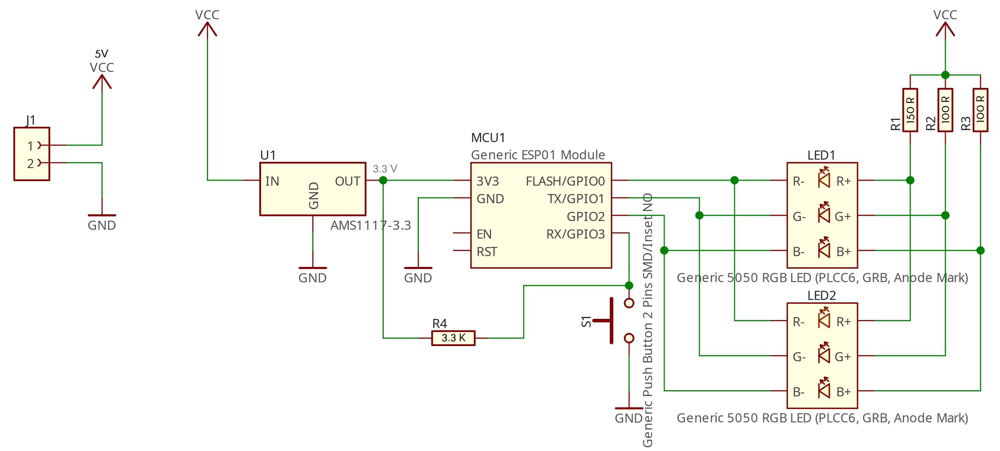

# Buzzer

## Build Instructions

### Bill of Materials

| Amount | Part Name | DIY | Buy | Image | Additional Notes |
|---|---|---|---|---|---|
| $1 \times$ | Buzzer | ❌ | https://www.amazon.com/dp/B0CPHT5N3X   https://www.ebay.com/itm/395040810324   https://www.amazon.com/dp/B0CGHFH3M1   https://www.amazon.com/dp/B0CQSXBK7R   https://www.sparkfun.com/products/9181   https://grobotronics.com/big-dome-push-button-red-100mm.html?sl=en   https://www.sparkfun.com/products/retired/11964 | | Preferrably with a transparent or white dome
| $1 \times$ | Buzzer Case | Click here | ❌ | | May not be neccessary, you can repurpose the outer shell of the buzzer
| $1 \times$ | 3D-Printed Bolt Holder | Click here | Can be ordered online using the design files | | Can be omitted in certain cases, should match the type of hollow M10 Bolt you are using
| $1 \times$ | M10 $\times$ 30mm Bolt (Hollow) | Click here | https://www.amazon.de/dp/B0BRNBQY3Y   https://www.ebay.com/itm/143405833724 | |
| $2 \times$ | M3 $\times$ 10mm Bolt (countersunk) |
| $2 \times$ | M3 $\times$ 12mm Bolt (countersunk) |
| $2 \times$ | M3 Nut |
| $2 \times$ | M3 Washer |
| $2 \times$ | M3 Rivet Nut | Click here | https://www.amazon.com/dp/B0962QQGFZ   https://www.ebay.com/itm/151788854026 | | Should have a height of at least [TODO]mm (so that the spring has enough room for actually compressing so the buzzer can be pressed)
| $2 \times$ | $6-8mm \times 14-20mm$ Compression Spring | Click here | | | The springs of some battery terminals work quite well here
| $1 \times$ | Custom PCB | Click here | The custom PCB can be ordered online (non-exhaustive list) from:   https://pcbway.com/   https://jlcpcb.com/
| $2 \times$ | ESP-01S Module | ❌ | https://www.amazon.com/dp/B09J2KPHTN   https://www.ebay.com/itm/334980650665 | | An ESP-01S is preferred over an ESP-01, but both can be used
| $1 \times$ | AMS1117-3.3V Voltage Regulator (SMD) | ❌ | https://www.amazon.com/dp/B07X75XXYL   https://www.ebay.com/itm/392097419034
| $2 \times$ | RGB LED (5050 SMD) | ❌ | https://www.amazon.com/dp/B01CUGABPU   https://www.ebay.com/itm/191674244800 | | The RGB LEDs should not have a common cathode, having individual anodes for each internal LED is preferred but not neccessary; WS2812B and other addressable LEDs are **NOT** supported by my PCB design
| $2 \times$ | 100 - 200 $\Omega$ Resistor (THT)
| $1 \times$ | 120 - 220 $\Omega$ Resistor (THT)
| $1 \times$ | 3.3 - 10 $k\Omega$ Resistor (THT)
| $1 \times$ | 2 Pin, 3.5mm Pitch Screw Terminal (THT) | ❌ | https://www.amazon.com/dp/B07B791NMQ   https://www.ebay.com/itm/195773785709   https://www.ebay.com/itm/314913808536 | | This can be omitted when soldering the power cable directly to the PCB; a larger or smaller pitch terminal can be used by changing the pcb design files
| $2 \times$ | 4 Pin, 2.54mm Pitch Round Female Pin Header/Socket (THT) | ❌ | https://www.amazon.com/dp/B0778TFL39   https://www.ebay.com/itm/285532509511   https://www.ebay.com/itm/196038438582 | | This can be omitted or replaced with other types of headers; in _both_ cases the pcb design should be changed
| $1 \times$ | $5.5mm \times 2.1mm$ DC Power Plug | ❌ | https://www.amazon.com/dp/B07Y8M8TWM   https://www.ebay.com/itm/114822858070 | | You can chose any plug you want, bear in mind that the plug has to fit through the same $\varnothing 10mm$ hole as the bolt
| $20cm$ | Flexible Power Cable
| $3cm$ | $\varnothing 9-14mm$ Heatshrink | | | | The heatshrink is only needed when removing the cover of your DC plug
| $5ml$ | White (Acrylic) Paint

### Required Tools
 - Screwdriver
   - Bit for your M3 Bolts
   - Bit for your screw terminal (optional)
 - Power Drill
   - 3mm Drill Bit
   - 10mm Drill Bit
 - Paint Brush
 - Soldering Iron + Solder
 - Pair of Pliers (probably)

## Assembly

[TODO]

## Disassembly and Repair

The buzzer contains moving/compliant parts and will be subject to breaking eventually. Here is how you can disassemble and repair the buzzer:

### 1. Undo the marked bolts

When you turn the buzzer around to the side where the cable comes out, there should be 4 bolts and whoever assembled it marked two opposing bolts. Undo these two bolts; the dome/springy part of the buzzer can now be taken out by pushing the hollow bolt/cable through the hole.

### 2. Take off the dome

Take a slim screwdriver or something else to pry and stick it between the lower and upper white parts. Use the screwdriver to pry these two pieces apart. You should be able to see a PCB now.

### 3. Take out the PCB

If possible, detach the power cable by unscrewing the bolts in the terminal block. Undo the two bolts securing the PCB to those long rivet nuts. Make sure you do not lose the rivet nuts or springs. Ideally, you now have only the PCB left and can start to test or resolder any component.

### 4. Take off the microcontroller

Should you need to take out the microcontroller (the extra pcb that kind of sticks up in the air), use pliers to gently wiggle it out of its socket. Try not to bend any of its pins. You can test and/or reprogram the microcontroller (look up "ESP-01" for more information) using the Arduino IDE.

### 5. Find the destroyed component

Please refer to the schematic below on how the PCB should work and which component is broken. More information can be found in the pcb subdirectory.

Common faults are:
 - lose power connection
 - broken switch (check for continuity across the switch)
 - lose connection between the ESP01 and its socket (try to power the whole PCB and gently wiggle the ESP; if the LEDs start to flicker, try to push the ESP back into its socket)
 - corrosion
 - faulty LED (check them using a diode tester)
 - faulty resistors (simply measure them and check with the schematic)
 - faulty voltage regulator AMS1117-3.3 (check if there are 3.3V between the middle pin of the regulator and GND)

Please note that although the ESP01/ESP8266 works with 3.3V, the LEDs are supplied with 5V. This is normal and _not_ a fault.

### 6. Repair the destroyed component

Please refer to the bill of materials above for all the components used and where to find replacements.

### 6. Reassemble

You can now reassemble the buzzer as described in the Assembly section, starting at [TODO]

## Schematic

